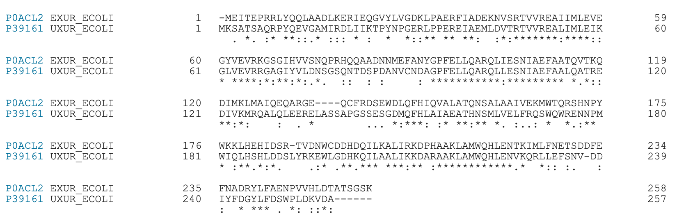

# Chip-seq

#### Экстрагируйте риды и обрежьте их с помощью Trimmomatic
```
$ trimmomatic SE -phred33 ../../../shared/ChIP-seq_data/ChIP_ExuR.fastq ChIP_ExuR.fastq ILLUMINACLIP:TruSeq3-SE:2:30:10 LEADING:3 TRAILING:3 SLIDINGWINDOW:4:15 MINLEN:36
$ trimmomatic SE -phred33 ../../../shared/ChIP-seq_data/ChIP_UxuR_1.fastq ChIP_UxuR_1.fastq ILLUMINACLIP:TruSeq3-SE:2:30:10 LEADING:3 TRAILING:3 SLIDINGWINDOW:4:15 MINLEN:36
$ trimmomatic SE -phred33 ../../../shared/ChIP-seq_data/ChIP_UxuR_2.fastq ChIP_UxuR_2.fastq ILLUMINACLIP:TruSeq3-SE:2:30:10 LEADING:3 TRAILING:3 SLIDINGWINDOW:4:15 MINLEN:36
$ trimmomatic SE -phred33 ../../../shared/ChIP-seq_data/control_ExuR.fastq control_ExuR.fastq ILLUMINACLIP:TruSeq3-SE:2:30:10 LEADING:3 TRAILING:3 SLIDINGWINDOW:4:15 MINLEN:36
$ trimmomatic SE -phred33 ../../../shared/ChIP-seq_data/control_UxuR.fastq control_UxuR.fastq ILLUMINACLIP:TruSeq3-SE:2:30:10 LEADING:3 TRAILING:3 SLIDINGWINDOW:4:15 MINLEN:36
```

Посмотрим на результаты, сгенерив отчеты FASTQC:
```
$ mkdir fastqc_res
$ ../hw1/FastQC/fastqc -o fastqc_res/ *.fastq
$ multiqc fastqc_res/
```


Явно есть большое количество дублей. Стоит их почистить. 

#### Наложите на геном E. coli K-12 MG1655 genome с помощью Bowtie

Скопируем геном E.coli на сервер:
```
scp -r -P 9022 E.coli_genome.fasta  polina_kudryavtseva@mg.uncb.iitp.ru:~/ChipSeq
```
Сгенерируем индексы по геному E.coli:
```
$ bowtie-build E.coli_genome.fasta e_coli
```

Выровняем риды на геном и сохраним в sam файл:
```
$ bowtie -S e_coli ChIP_ExuR.fastq ChIP_ExuR.sam
$ bowtie -S e_coli ChIP_UxuR_1.fastq ChIP_UxuR_1.sam
$ bowtie -S e_coli ChIP_UxuR_2.fastq ChIP_UxuR_2.sam
$ bowtie -S e_coli control_ExuR.fastq control_ExuR.sam
$ bowtie -S e_coli control_UxuR.fastq control_UxuR.sam
```
- ChIP_ExuR: reads that failed to align: 1159025 (5.37%)
- ChIP_UxuR_1: reads that failed to align: 20562418 (35.54%)
- ChIP_UxuR_2: reads that failed to align: 3636266 (15.30%)
- control_ExuR: reads that failed to align: 1850909 (9.64%)
- control_UxuR: reads that failed to align: 7587855 (33.17%)

Явно есть какие то проблемы с экспериментом UxuR_1. 

Переведем все файлы в формат bam, отсортируем их и почистим дубли.
```
$ samtools view -S -b ChIP_ExuR.sam > ChIP_ExuR.bam
$ samtools sort ChIP_ExuR.bam -o ChIP_ExuR.sorted.bam

$ samtools view -S -b ChIP_UxuR_1.sam > ChIP_UxuR_1.bam
$ samtools sort ChIP_UxuR_1.bam -o ChIP_UxuR_1.sorted.bam

$ samtools view -S -b ChIP_UxuR_2.sam > ChIP_UxuR_2.bam
$ samtools sort ChIP_UxuR_2.bam -o ChIP_UxuR_2.sorted.bam

$ samtools view -S -b control_ExuR.sam > control_ExuR.bam
$ samtools sort control_ExuR.bam -o control_ExuR.sorted.bam

$ samtools view -S -b control_UxuR.sam > control_UxuR.bam
$ samtools sort control_UxuR.bam -o control_UxuR.sorted.bam
```

#### Найдите пики с помощью MACS2 (подсказки тут - https://hbctraining.github.io/Intro-to-ChIPseq/lessons/05_peak_calling_macs.html) 
Попытка стандартного запуска провалилась с ошибкой ``` Too few paired peaks (14) so I can not build the model!```. Поэтому запуск возможен только с параметрами -```-nomodel --shiftsize 100```. Выходит, macs2 не может найти достаточно парных пиков для построения модели и оценки размера фрагментов. 
```
$ mkdir macs2
$ macs2 callpeak -t ChIP_ExuR.sorted.bam -c control_ExuR.sorted.bam -g 4641652 -n exur -q 0.01 --nomodel --shiftsize 100
$ macs2 callpeak -t ChIP_UxuR_1.sorted.bam -c control_UxuR.sorted.bam -g 4641652 -n uxur1 -q 0.01 --nomodel --shiftsize 100
$ macs2 callpeak -t ChIP_UxuR_2.sorted.bam -c control_UxuR.sorted.bam -g 4641652 -n uxur2 -q 0.01 --nomodel --shiftsize 100
```

Посчитаем общее число найденных пиков:
```
wc -l macs2/exur_peaks.bed
wc -l macs2/uxur1_peaks.bed
wc -l macs2/uxur2_peaks.bed
```

Для ExuR нашлось 157 пиков, для UxuR-1 - 1109, для UxuR2 - 196. 
Огоромное число пиков для UxuR-1 настораживает. 

#### Гомологичны ли белки ExuR и UxuR? 

Не знаю как просто проверить гомлогию кроме как выравниванием. Найдем последовательности в UniProt и выровняем.


Процент идентичности: 42.424%. Это довольно мало, так что считаю, что белки не гомологичны.

#### В каком эксперименте есть проблемы, с чем они могут быть связаны и как их решить? 

Явные проблемы на всем пути обработки данных возникали с экспериментом UxuR-1. Если пробежать глазами по выдаче macs2, видно что он нашел очень много маленьких пиков, что больше похоже на контроль, а не на правильный эксперимент. Возможно большая требовательность к поиску пиков, то есть меньшее значение q-value, дала бы лучший результат. Еще хорошо посмотреть на пики глазами в IGV. Также в этом эксперименте очень высокое покрытие, стоит сделать меньше.

Ну и в целом узнать про цели эксперимента у лаборатории, про то как делался контроль, что именно хотели увидеть в результатах. 

#### Предположите, чем могут отличаться эксперименты UxuR1 и UxuR2 с биологической точки зрения 

Возможно это реплики одного эксперимента, просто первый передержали и поэтому сделалаи второй :) А может UxuR1 - это контроль. Или же эксперименты делали в разных условиях, чтобы достичь разных целей.

#### Используя ChIPMunk, найдите мотив для одного из этих белков (выберите белок, исходя из вашего ответа на п.6) 

Смотреть будем на UxuR2. Сопоставим координатам пиков геном, чтобы вытащить нуклеотидные последовательности.
```
bedtools getfasta -fi E.coli_genome.fasta -bed macs2/uxur2_peaks.bed -fo motif.fasta
```
Скачаем и запустим ChIPMunk
```
wget http://autosome.ru/ChIPMunk/chipmunk.jar
java -jar chipmunk.jar s:motif.fasta
```
Визуализация найденного мотива:

#### (Optional) Поскольку вам рассказывали про МЕМE - сравните мотивы, полученные с помощью ChIPMunk и МЕМЕ. Какой мотив лучше и почему?
На том же файле запустим MEME через веб интерфейс.
Визуализация найденного мотива:


